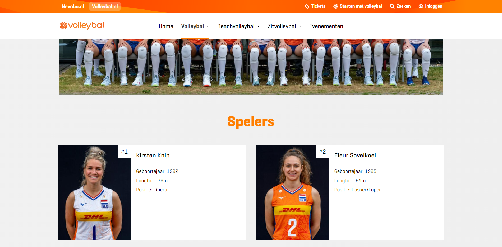
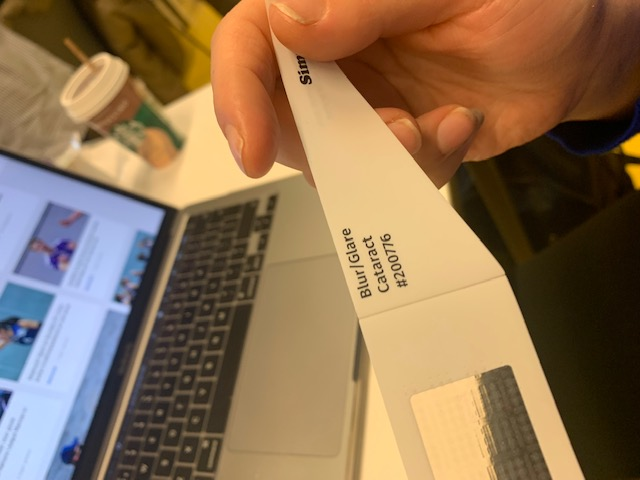
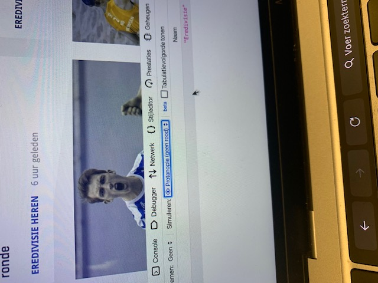
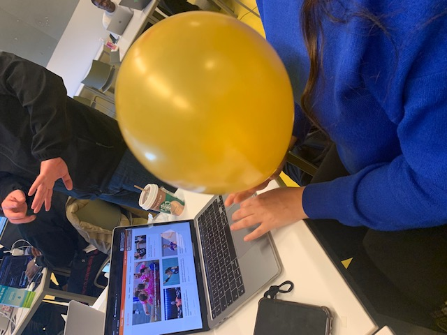

# Procesverslag
Markdown is een simpele manier om HTML te schrijven.  
Markdown cheat cheet: [Hulp bij het schrijven van Markdown](https://github.com/adam-p/markdown-here/wiki/Markdown-Cheatsheet).

Nb. De standaardstructuur en de spartaanse opmaak van de README.md zijn helemaal prima. Het gaat om de inhoud van je procesverslag. Besteedt de tijd voor pracht en praal aan je website.

Nb. Door *open* toe te voegen aan een *details* element kun je deze standaard open zetten. Fijn om dat steeds voor de relevante stuk(ken) te doen.

## Jij

  
uitwerken voor kick-off werkgroep

  ### Auteur:
  Donna Baijens

  #### Je startniveau:
  rood

  #### Je focus:
  responsive, maar misschien wel allebei ;)
 

## Je website

  
uitwerken voor kick-off werkgroep

  ### Je opdracht:
  https://www.bol.com/nl/nl/

  #### Screenshot(s) van de eerste pagina (small screen): 
  Account/Inloggen
  

  #### Screenshot(s) van de tweede pagina (small screen):
  Boeken Literatuur & Romans 
  

  ### Je opdracht:
  https://www.volleybal.nl/

  #### Screenshot(s) van de eerste pagina (small screen): 
  TeamNL Volleybaldames Team
  

  #### Screenshot(s) van de tweede pagina (small screen):
  Evenementen/Updates
  

  ### Uiteindelijke keuze website opdracht:
  https://www.volleybal.nl/

  #### Screenshot(s) van de eerste pagina (small screen): 
  Homepagina Volleybal.nl
  

  #### Screenshot(s) van de tweede pagina (small screen):
  Praktische informatie (met drie pagina's waar je naartoe kunt gaan: Veelgestelde vragen, Spelregels, Talentontwikkeling)
  
 

## Toegankelijkheidstest 1/2 (week 1)

  
uitwerken na test in 1e werkgroep

  ### Bevindingen
  Lijst met je bevindingen die in de test naar voren kwamen: (allemaal met Valena gedaan)

  #### Screenreader
  Hier korte omschrijving (met indien nodig afbeeldingen)
  Links en headers doen het via H en K op het toetsenbord. Bij Windows kun je dit aanzetten met Caps lock en spatie
  tegelijk ingedrukt houden. Zo kun je de scan aanzetten, zodat je op H en K kan klikken. Op Mac was het ook goed te volgen.
  
  

  Hier een omschrijving van hoe het opgelost kan worden (met indien nodig afbeeldingen)
  Het was al goed bij mijn site. Met H ging hij alle headers af op de site en met K ging hij alle linkjes af op de site.

  #### Muis en Toetsenbord 
  Hier korte omschrijving (met indien nodig afbeeldingen)
  Website geeft duidelijk aan waar je bent met 'Home' etc.
  Hover doet de website
  
  
  Active heeft de website niet
  
  Focus doet de website
  

  Met pijltjes op het toetsenbord kun je alleen scrollen.

  Tab werkt goed op het toetsenbord.
  
  

  Hier een omschrijving van hoe het opgelost kan worden (met indien nodig afbeeldingen)

  Active is wel leuk om nog toe te voegen, dat als je ergens op klikt, dat je dan snel een andere kleur ziet bijvoorbeeld.
  Verder is het logisch dat je met pijltjes alleen kan scrollen en de tab doet het verder goed.

  #### Motoriek (shocks, elastiekjes)
  Hier korte omschrijving (met indien nodig afbeeldingen)

  Shocks was erg interessant om te proberen, want je bent het niet gewend om zulke trillingen bij je zenuwen te hebben.
  Het was een gek gevoel. Typen ging lastiger, maar dat was niet nodig bij mijn site, alleen als je de zoekbalk wil gebruiken.
  Het gaat eigenlijk gewoon niet om met Parksinson een website te besturen, het is heel moeilijk.
  
  

  Hier een omschrijving van hoe het opgelost kan worden (met indien nodig afbeeldingen)
  Dit is erg lastig om op te lossen, want niet veel mensen hebben het. Degene die het hebben, die kunnen het onder controle krijgen.
  Misschien meer plaatjes dan tekst en sowieso niet iets van een typfunctie op je website, zodat dat in ieder geval geen probleem kan vormen.

  Hier korte omschrijving (met indien nodig afbeeldingen)

  Elastiekjes ging makkelijk en goed. Het enige is dat bij de zoekbalk misschien met typen een spraakfunctie moet komen, omdat typen erg lastig is als je bijvoorbeeld vingers gebroken hebt met gips en dat je dan kan spreken in plaats van typen.
  
  
  

  Hier een omschrijving van hoe het opgelost kan worden (met indien nodig afbeeldingen)
  Een spraakfunctie toevoegen of eigenlijk de screenreader gebruiken.

  #### Visueel (brillen, contrast, kleurenblind, dark/light). 
  Hier korte omschrijving (met indien nodig afbeeldingen)

  De brillen waren erg interessant om mee te oefenen. Het spreekt voor zich dat je met deze brillen een stuk minder goed de website kunt bekijken en veel beperkingen hebt. 

  

  Bril 1 peripheral field loss:
  Bij deze bril zag Valena echt helemaal niks.
  

  Bril 2 combined loss (diabetic eye disease):
  Deze beperking is heel vermoeiend. De kleine tekst is niet te lezen. Er zijn allemaal vlekken, dus je moet echt kunnen inzoomen op je website.
  

  Bril 3 central field loss:
  Deze bril is heel irritant. Ze ziet allemaal zwarte vlekken en alleen de randjes ziet ze.
  

  Bril 4 hemifield loss:
  Alles ziet ze redelijk, behalve de zijkanten.
  

  Bril 5 blur/glare:
  Deze bril is alleen leuk als je heel erg kunt inzoomen, anders is het niet te lezen.
  

  Bril 6 color:
  Deze bril is goed te doen. Dit heeft mijn website al. 
  

  Bril 7 low contrast:
  Het contrast moet feller op mijn website. Nu is het heel licht, wazig. 
  

  Hier een omschrijving van hoe het opgelost kan worden (met indien nodig afbeeldingen)

  Het handigste is om vooral plaatjes te gebruiken. De kleine tekst valt weg, dus misschien grote tekst gebruiken. 'Meer' op de homepagina valt al helemaal weg, doordat het zo klein is. 

  Hier korte omschrijving (met indien nodig afbeeldingen)

  Contrast/kleurenblindheid ging goed bij mijn website. Er is een goed contrast te zien en er is rekening gehouden met mensen die kleurenblind zijn. 

  Contrastverlies
  
  
  

  Achromatopsie (geen kleur)

  
  

  Tritanopie (geen blauw)

  
  

  Protanopie (geen rood)

  
  

  Deuteranopie (geen groen)

  
  

  Hier een omschrijving van hoe het opgelost kan worden (met indien nodig afbeeldingen)

  Het enige is dat bij 'geen blauw' de kleuren een beetje te fel zijn. Hier zou ik dan de roze/rood tinten wat minder fel maken. 

  Hier korte omschrijving (met indien nodig afbeeldingen)

  De dark en light mode was makkelijk te zien: mijn website heeft geen dark mode, alleen een light mode. Als ik mijn laptop (Windows) naar dark mode zette, dan werden alleen mijn taakbalk en de browser zwart, de rest bleef wit.

  Hier een omschrijving van hoe het opgelost kan worden (met indien nodig afbeeldingen)

  Hoe dit opgelost kan worden, is om een dark mode toe te voegen voor mijn website.

  

  #### Afleiding met ballon
  Hier korte omschrijving (met indien nodig afbeeldingen)
  
  De afleiding met ballon ging goed. De website was alsnog goed te bedienen, ook al was ze afgeleid.
  
  
  
  

  Hier een omschrijving van hoe het opgelost kan worden (met indien nodig afbeeldingen)
  
  Ze kon de website al goed bedienen. Misschien meer plaatjes in plaats van tekst, zodat je door de plaatjes al snel kunt begrijpen waar het over gaat.

## Breakdownschets (week 1)

  
uitwerken na afloop 2e werkgroep

  ### de hele pagina: 
  

  ### dynamisch deel (bijv menu): 
  

  ### wellicht nog een dynamisch deel (bijv filter): 
  

## Voortgang 1 (week 2)

  
uitwerken voor 1e voortgang

  ### Stand van zaken
  hier dit ging goed & dit was lastig (neem ook screenshots op van delen van je website en code)

  ### Agenda voor meeting
  samen met je groepje opstellen

  | student 1      | student 2          | student 3    | student 4        |
  | ---            | ---                | ---          | ---              |
  | dit bespreken  | en dit             | en ik dit    | en dan ik dat    |
  | en dat ook nog | dit als er tijd is | nog een punt | dit wil ik zeker |
  | ...            | ...                | ...          | ...              |

  ### Verslag van meeting
  hier na afloop snel de uitkomsten van de meeting vastleggen

  - punt 1
  - punt 2
  - nog een punt
  - ...

## Voortgang 2 (week 3)

  
uitwerken voor 2e voortgang

  ### Stand van zaken
  hier dit ging goed & dit was lastig (neem ook screenshots op van delen van je website en code)

  ### Agenda voor meeting
  samen met je groepje opstellen

  | student 1      | student 2          | student 3    | student 4        |
  | ---            | ---                | ---          | ---              |
  | dit bespreken  | en dit             | en ik dit    | en dan ik dat    |
  | en dat ook nog | dit als er tijd is | nog een punt | dit wil ik zeker |
  | ...            | ...                | ...          | ...              |

  ### Verslag van meeting
  hier na afloop snel de uitkomsten van de meeting vastleggen

  - punt 1
  - punt 2
  - nog een punt
- ...

## Toegankelijkheidstest 2/2 (week 4)

  
uitwerken na test in 8e werkgroep

  ### Bevindingen
  Lijst met je bevindingen die in de test naar voren kwamen (geef ook aan wat er verbeterd is):

  #### Screenreader
  Hier korte omschrijving (met indien nodig afbeeldingen)

  Hier een omschrijving van hoe het opgelost kan worden (met indien nodig afbeeldingen)

  #### Muis en Toetsenbord 
  Hier korte omschrijving (met indien nodig afbeeldingen)

  Hier een omschrijving van hoe het opgelost kan worden (met indien nodig afbeeldingen)

  #### Motoriek (shocks, elastiekjes)
  Hier korte omschrijving (met indien nodig afbeeldingen)

  Hier een omschrijving van hoe het opgelost kan worden (met indien nodig afbeeldingen)

  #### Visueel (brillen, contrast, kleurenblind, dark/light). 
  Hier korte omschrijving (met indien nodig afbeeldingen)

  Hier een omschrijving van hoe het opgelost kan worden (met indien nodig afbeeldingen)

## Voortgang 3 (week 4)

  
uitwerken voor 3e voortgang

  ### Stand van zaken
  hier dit ging goed & dit was lastig (neem ook screenshots op van delen van je website en code)

  ### Agenda voor meeting
  samen met je groepje opstellen

  | student 1      | student 2          | student 3    | student 4        |
  | ---            | ---                | ---          | ---              |
  | dit bespreken  | en dit             | en ik dit    | en dan ik dat    |
  | en dat ook nog | dit als er tijd is | nog een punt | dit wil ik zeker |
  | ...            | ...                | ...          | ...              |

  ### Verslag van meeting
  hier na afloop snel de uitkomsten van de meeting vastleggen

  - punt 1
  - punt 2
  - nog een punt
  - ...

## Eindgesprek (week 5)

  
uitwerken voor eindgesprek

  ### Je uitkomst - karakteristiek screenshots:
  

  ### Dit ging goed/Heb ik geleerd: 
  Korte omschrijving met plaatjes

  

  ### Dit was lastig/Is niet gelukt:
  Korte omschrijving met plaatjes

  

## Bronnenlijst

  
continu bijhouden terwijl je werkt

  Nb. Wees specifiek ('css-tricks' als bron is bijv. niet specifiek genoeg).

  1. bron 1
  2. bron 2
  3. ...

